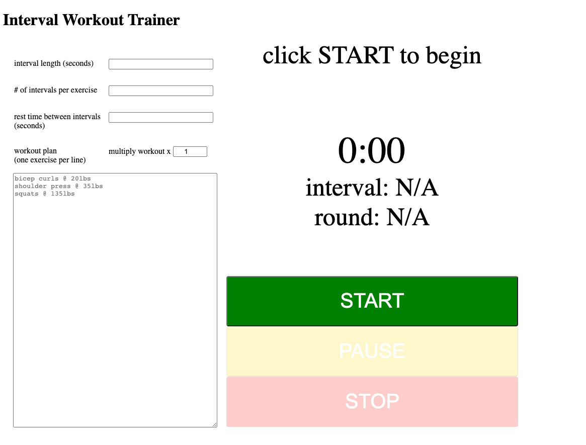

# interval-trainer-js
---
permalink: /index.html
---

A Simple tool to time my interval workouts at home. Written in good old fashioned vanilla javascript.
 

## background
Due to the COVID-19 Pandemic, many other gym enthusiasts like myself have had to move their workouts to their home garages.
  
In the absence of access to larger dumbells and other freeweights, I decided I would increase the intensity of the workouts with time elapsed per exercise to make incremental progress rather than use incremental weight increase. Naturally I needed a tool for this job and figured anything available currently was overly complicated with too many options so my solution was to create my own.
  
Thought I'd share on here incase someone else needs something similar.

## usage

to use locally just download this repo and open index.html in a web browser application (chrome preferred)
<strong>OR</strong>
use the github pages hosted <a href='https://matthewlamdotjs.github.io/interval-trainer-js/'>here</a>
  

